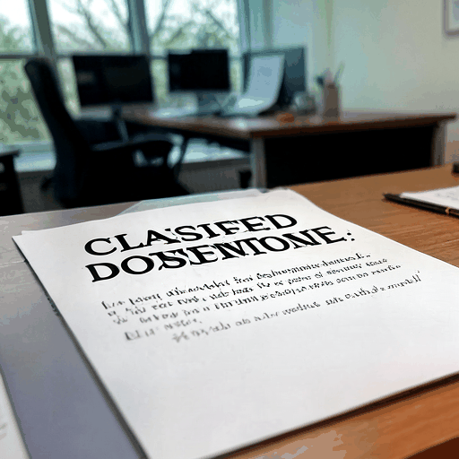

# autoblur



*The demo loops through each sample image and the version autoblur produced
(1s per frame). The source images live in the [`samples/`](samples/) directory
and were generated with **1-bit and Ternary Bonsai Image 4B** from
[Prism ML](https://prismml.com/news/bonsai-image-4b).*

Quick-and-dirty pre-sharing photo cleanup for macOS. Point it at a photo and it
automatically blurs **text** (signs, addresses, names, account/license numbers,
screens) and **faces** — no editing tool required. Hand it a single image, a
batch of files, or a whole folder (optionally recursing into subfolders) and it
cleans each one in place.

Detection uses Apple's built-in **Vision** framework (runs on-device, no model
downloads, no network). Blurring is done with Pillow using an irreversible
mosaic + light Gaussian so the original content can't be recovered.

## Requirements

- macOS (uses the native Vision framework)
- Python 3.9+

## Install & run

The `autoblur` wrapper script sets up a local virtualenv on first run:

```bash
./autoblur photo.jpg
```

That writes `photo_blurred.jpg` next to the original.

Or run it manually:

```bash
python3 -m venv .venv
.venv/bin/pip install -r requirements.txt
.venv/bin/python autoblur.py photo.jpg
```

## Usage

```bash
./autoblur photo.jpg                  # blur both text and faces
./autoblur photo.jpg -o clean.jpg     # choose the output path
./autoblur *.jpg                      # batch process many files
./autoblur ./photos                   # every image in a folder
./autoblur ./photos -r                # ...and all its subfolders
./autoblur photo.jpg --faces-only     # faces only
./autoblur photo.jpg --text-only      # text only
./autoblur photo.jpg --preview        # draw detection boxes instead of blurring
./autoblur photo.jpg --strength 0.6   # stronger blur (0.2-0.7, default 0.45)
./autoblur photo.jpg --padding 0.1    # grow each region before blurring

# Double-check the result with a vision model and re-blur anything missed:
./autoblur photo.jpg --verify-model gpt-4o
./autoblur photo.jpg --verify-model llama3.2-vision \
    --verify-base-url http://localhost:11434/v1   # local Ollama

# Or re-check entirely on-device by re-running Apple Vision (no network/key):
./autoblur photo.jpg --verify-local
./autoblur photo.jpg --verify-local --verify-model gpt-4o   # both, in order
```

You can mix files and folders in a single command. When an argument is a
folder, autoblur scans it for images (`.jpg`, `.jpeg`, `.png`, `.bmp`, `.gif`,
`.tif`, `.tiff`, `.webp`); add `-r/--recursive` to descend into subfolders.
Each result is written as `<name>_blurred<ext>` next to its original, and
autoblur skips files that already look like its own output, so re-running over
a folder won't reprocess earlier results.

| Option            | Description                                                        |
|-------------------|--------------------------------------------------------------------|
| `-o, --output`    | Output path (single image only). Default `<name>_blurred<ext>`.    |
| `-r, --recursive` | Descend into subfolders when an input is a directory.              |
| `--faces-only`    | Blur faces only.                                                   |
| `--text-only`     | Blur text only.                                                    |
| `--preview`       | Draw red (text) / blue (face) boxes instead of blurring.           |
| `--strength`      | Blur strength `0.2`–`0.7`; higher is blurrier. Default `0.45`.     |
| `--padding`       | Extra padding around each region, as a fraction. Default `0.06`.   |
| `--verify-local`  | Re-run on-device Apple Vision on the result and re-blur survivors (offline, no key). |
| `--verify`        | Re-check the blurred image with a vision model (needs `--verify-model`). |
| `--verify-model`  | Model name for verification, e.g. `gpt-4o` (implies `--verify`).   |
| `--verify-base-url` | OpenAI-compatible API base URL. Default OpenAI; e.g. Ollama's `http://localhost:11434/v1`. |
| `--verify-api-key-env` | Env var holding the API key. Default `OPENAI_API_KEY`.        |
| `--verify-max-passes` | Max verify/re-blur iterations per image. Default `2`.          |

## Second pass: catching the outliers

The first pass is fast but not perfect — small, low-contrast, rotated, or
stylized text and the occasional face can slip through. autoblur can take a
**second look at its own output** and re-blur anything that survived, looping
until a pass comes up clean (or `--verify-max-passes` is reached). There are two
independent verifiers, and you can use either or both:

- **On-device (`--verify-local`)** — re-runs Apple Vision on the blurred image.
  Free, offline, no API key, deterministic. Best default for catching outliers
  of the *same kinds* autoblur already detects (text and faces).
- **Vision model (`--verify-model`)** — sends the blurred image to a vision LLM
  for a broader "is anything still readable or identifiable?" judgement. Catches
  things a plain detector won't reason about, at the cost of a network call (or a
  local model) and a bit of latency.

When both are given, the on-device pass runs first, then the model pass. A
model/network failure is reported as a warning and never discards the
already-blurred first-pass result.

```bash
./autoblur photo.jpg --verify-local                       # on-device second pass
./autoblur photo.jpg --verify-local --verify-max-passes 3 # allow more iterations
./autoblur photo.jpg --verify-local --verify-model gpt-4o # both, in order
```

### Quickstart: verify with an LLM vision model

The model is reached over any **OpenAI-compatible `/chat/completions`
endpoint**, so the same flags work with hosted and local providers. Only the
Python standard library is used for the call — no extra dependencies.

**OpenAI (hosted):**

```bash
export OPENAI_API_KEY="sk-..."          # default env var autoblur reads
./autoblur photo.jpg --verify-model gpt-4o
```

**Ollama (local, no API key):**

```bash
ollama pull llama3.2-vision             # or any vision-capable model
./autoblur photo.jpg --verify-model llama3.2-vision \
    --verify-base-url http://localhost:11434/v1
```

**LM Studio (local):**

```bash
# Start LM Studio's local server, then point autoblur at it:
./autoblur photo.jpg --verify-model your-loaded-model \
    --verify-base-url http://localhost:1234/v1
```

**OpenRouter or any other provider:**

```bash
export OPENROUTER_API_KEY="sk-or-..."
./autoblur photo.jpg --verify-model "openai/gpt-4o" \
    --verify-base-url https://openrouter.ai/api/v1 \
    --verify-api-key-env OPENROUTER_API_KEY
```

Notes:

- The API key is read from an **environment variable** (default
  `OPENAI_API_KEY`; override with `--verify-api-key-env`), never passed on the
  command line, so it stays out of your shell history. Local servers like Ollama
  usually need no key.
- `--verify-base-url` defaults to OpenAI; you can also set it once via the
  `AUTOBLUR_VERIFY_BASE_URL` environment variable.
- Pick a model that actually accepts image input (e.g. `gpt-4o`,
  `llama3.2-vision`, `qwen2.5-vl`); text-only models will fail the call.
- Enabling `--verify-model` uploads the (already blurred) image to whichever
  endpoint you choose. Use `--verify-local` if you want to stay fully offline.

## How it works

1. The image is opened with Pillow and its EXIF orientation is baked in so pixel
   coordinates line up with what Vision sees.
2. Text is found with **two complementary Vision passes**, unioned for
   coverage: `VNDetectTextRectanglesRequest` (a fast region detector that
   catches blocks of text even when they aren't cleanly legible) and
   `VNRecognizeTextRequest` (Vision's OCR engine, which is more thorough on
   isolated tokens like dates and short numbers). Faces are found with
   `VNDetectFaceRectanglesRequest`.
3. Each region is downscaled hard and scaled back up (mosaic), then lightly
   Gaussian-blurred. Text uses larger mosaic cells (its line height is small, so
   cells must be a big fraction of it to destroy the glyphs); faces use a finer
   mosaic and a bit of extra padding to cover hair, ears and chin.
4. *(Optional, with `--verify-local`)* Apple Vision is re-run on the blurred
   image to catch anything the first pass missed (small or low-contrast text, a
   face the detector skipped). This runs entirely on-device — no network, no API
   key. Because Vision's region detector can still flag an already-mosaicked
   block as "text", each new detection is ignored when it is mostly covered by a
   region autoblur already blurred, so only genuinely-missed content is
   re-blurred. The loop repeats until a pass finds nothing new or
   `--verify-max-passes` is hit.
5. *(Optional, with `--verify-model`)* The blurred image is sent to a
   user-defined vision model through any OpenAI-compatible
   `/chat/completions` endpoint (OpenAI, Ollama, LM Studio, OpenRouter, a local
   server, …). The model is asked for the bounding boxes of anything still
   readable or recognizable; those regions are blurred and the image is sent
   back for another look, repeating until the model is satisfied or
   `--verify-max-passes` is hit. The call uses only the Python standard
   library — no extra dependencies — and a network/model failure is reported as
   a warning without discarding the first-pass result. `--verify-local` and
   `--verify-model` can be combined; the on-device pass runs first.

## Limitations & tips

- Vision has no generic "sign" detector, but signs almost always contain text,
  so text detection covers them. Logos/symbols without text are **not** detected.
- Detection isn't perfect. Use `--preview` to check coverage before trusting a
  result, and bump `--strength` / `--padding` if something slips through.
- Very small or low-contrast text may be missed. This is a fast cleanup tool,
  not a guaranteed redaction tool for high-stakes documents.
- The mosaic is destructive (the blurred output cannot be un-blurred), but always
  keep your original — autoblur never overwrites it unless you pass `-o` pointing
  at the same file.

## License

Released under the [MIT License](LICENSE).

> **Disclaimer:** autoblur is a best-effort convenience tool, not a guaranteed
> redaction solution. Detection can miss text or faces. Always review the output
> (e.g. with `--preview`) before sharing anything sensitive.
